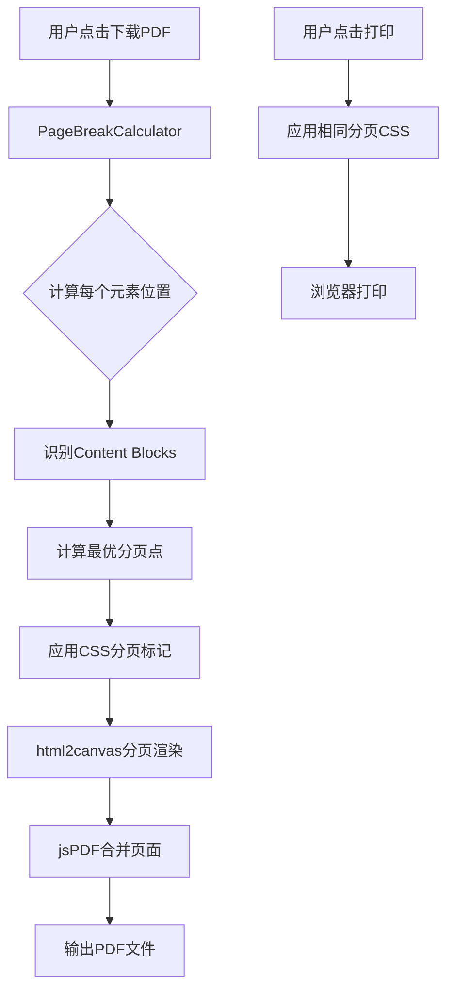

# Design Document: PDF分页优化

## Overview

本设计文档描述如何优化简历生成器的PDF下载和打印功能，实现智能分页以避免内容在页面分界处被截断。

当前实现使用 `html2canvas` 将整个简历渲染为一张图片，然后按A4高度机械切割。这种方式会导致section标题、工作经历条目、技能组等内容被从中间截断。

新方案将采用基于DOM元素的智能分页算法，在渲染PDF前计算每个内容块的位置，确保分页点落在合适的位置。

## Architecture



## Components and Interfaces

### 1. PageBreakCalculator

负责计算最优分页点的核心模块。

```typescript
interface ContentBlock {
  element: HTMLElement;
  type: 'section-header' | 'section-item' | 'skill-group' | 'highlight-item';
  top: number;      // 相对于简历顶部的位置 (px)
  height: number;   // 元素高度 (px)
  canBreak: boolean; // 是否可以在此元素前分页
  mustKeepWithNext: boolean; // 是否必须与下一个元素保持在同一页
}

interface PageBreakResult {
  breakPoints: number[];  // 分页点位置数组 (px)
  pageCount: number;
  warnings: string[];     // 无法避免截断的警告
}

interface PageBreakCalculator {
  /**
   * 分析简历DOM，识别所有内容块
   */
  analyzeContentBlocks(resumeElement: HTMLElement): ContentBlock[];
  
  /**
   * 计算最优分页点
   * @param blocks 内容块数组
   * @param pageHeight 页面可用高度 (px)
   * @param minBottomMargin 页面底部最小留白 (px)
   */
  calculateBreakPoints(
    blocks: ContentBlock[], 
    pageHeight: number,
    minBottomMargin: number
  ): PageBreakResult;
}
```

### 2. PDFRenderer

负责将分页后的内容渲染为PDF。

```typescript
interface PDFRendererOptions {
  scale: number;           // 渲染缩放比例
  pageWidth: number;       // 页面宽度 (mm)
  pageHeight: number;      // 页面高度 (mm)
  margin: number;          // 页面边距 (mm)
}

interface PDFRenderer {
  /**
   * 根据分页点渲染PDF
   */
  render(
    resumeElement: HTMLElement,
    breakPoints: number[],
    options: PDFRendererOptions
  ): Promise<jsPDF>;
}
```

### 3. CSS Print Styles

增强的打印样式，确保浏览器打印时也能正确分页。

```css
/* 内容块分页控制 */
.resume-section {
  page-break-inside: avoid;
  break-inside: avoid;
}

.resume-section-header {
  page-break-after: avoid;
  break-after: avoid;
}

.resume-item {
  page-break-inside: avoid;
  break-inside: avoid;
}

.skill-group {
  page-break-inside: avoid;
  break-inside: avoid;
}
```

## Data Models

### ContentBlock 类型定义

```typescript
type ContentBlockType = 
  | 'section-header'   // Section标题 (如"工作经历"、"专业技能")
  | 'section-item'     // Section内的条目 (如一条工作经历)
  | 'skill-group'      // 技能组 (如"Frontend: React, TypeScript...")
  | 'highlight-item';  // 条目内的highlight列表项

interface ContentBlock {
  id: string;
  element: HTMLElement;
  type: ContentBlockType;
  top: number;
  height: number;
  canBreak: boolean;
  mustKeepWithNext: boolean;
  parentId?: string;  // 父级内容块ID
}
```

### 分页配置

```typescript
interface PageBreakConfig {
  pageHeightMm: 297;           // A4高度
  pageWidthMm: 210;            // A4宽度
  marginMm: 12;                // 页面边距
  minSectionHeaderSpace: 40;   // Section标题后最小空间 (mm)
  minItemSpace: 20;            // 条目后最小空间 (mm)
}
```

## Correctness Properties

*A property is a characteristic or behavior that should hold true across all valid executions of a system-essentially, a formal statement about what the system should do. Properties serve as the bridge between human-readable specifications and machine-verifiable correctness guarantees.*

### Property 1: Section标题不孤立

*For any* 生成的PDF，每个Section标题后面要么有至少40mm的内容空间，要么标题位于新页的顶部（加上边距）。

**Validates: Requirements 1.1, 1.2**

### Property 2: 条目完整性

*For any* 高度小于页面可用高度的Section条目（工作经历、项目等），该条目必须完整显示在单一页面内，不会被分页截断。

**Validates: Requirements 2.1, 2.2**

### Property 3: 超长条目分页点合理性

*For any* 高度超过页面可用高度的Section条目，分页点必须位于highlight列表项之间，而非在文字行中间。

**Validates: Requirements 2.3**

### Property 4: 技能组完整性

*For any* 技能组，如果其高度小于页面可用高度，则该技能组必须完整显示在单一页面内。

**Validates: Requirements 3.1, 3.2**

### Property 5: 页面边距一致性

*For any* 生成的PDF的每一页，顶部边距必须等于配置的边距值（12mm）。

**Validates: Requirements 4.1, 4.2**

### Property 6: 打印与PDF一致性

*For any* 简历内容，打印输出的分页位置应与PDF下载的分页位置一致。

**Validates: Requirements 5.1**

## Error Handling

### 超长内容处理

当单个内容块（如一条工作经历）高度超过整页可用高度时：

1. 首先尝试在highlight列表项之间分页
2. 如果单个highlight也超长，在段落之间分页
3. 记录警告信息，提示用户内容可能需要精简

### 边界情况

- 空简历：直接生成单页空白PDF
- 只有一个Section：正常处理，无需分页
- 所有内容都在一页内：不添加分页点

## Testing Strategy

### 单元测试

1. `PageBreakCalculator.analyzeContentBlocks` - 测试DOM分析是否正确识别所有内容块
2. `PageBreakCalculator.calculateBreakPoints` - 测试分页点计算逻辑
3. CSS选择器测试 - 确保正确的元素被标记为内容块

### 属性测试

使用 `fast-check` 进行属性测试：

1. 生成随机简历数据（不同数量的工作经历、项目、技能等）
2. 渲染简历并计算分页点
3. 验证上述6个正确性属性

### 集成测试

1. 端到端PDF生成测试
2. 打印预览测试
3. 不同模板的分页测试

### 测试配置

- 属性测试最少运行100次迭代
- 每个测试用例需标注对应的设计属性
- 标签格式: **Feature: pdf-page-break-optimization, Property {number}: {property_text}**
