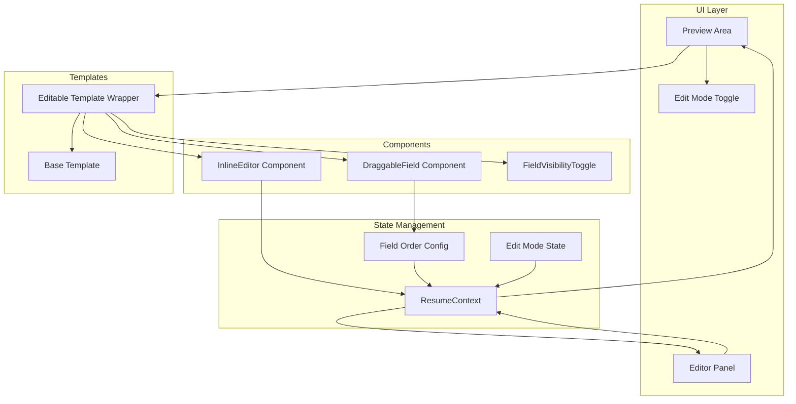

# Design Document: Template Field Editing

## Overview

本设计文档描述了简历生成器中模板字段编辑与拖拽排版功能的技术实现方案。该功能允许用户直接在预览区域编辑简历内容，并通过拖拽调整字段的显示顺序，实现所见即所得的简历定制体验。

核心设计原则：
- 使用现有的 `@dnd-kit` 库实现拖拽功能（项目已安装）
- 保持 ResumeContext 作为单一数据源
- 渐进式增强，不破坏现有模板结构
- 支持所有现有模板的字段编辑和排序

## Architecture



## Components and Interfaces

### 1. InlineEditor Component

可复用的内联编辑组件，支持单行和多行文本编辑。

```typescript
interface InlineEditorProps {
  value: string;
  onChange: (value: string) => void;
  multiline?: boolean;
  placeholder?: string;
  className?: string;
  disabled?: boolean;
}

// 使用示例
<InlineEditor
  value={basics.name}
  onChange={(value) => updateBasics({ name: value })}
  className="text-5xl font-serif"
/>
```

### 2. DraggableField Component

可拖拽字段包装组件，使用 @dnd-kit 实现。

```typescript
interface DraggableFieldProps {
  id: string;
  children: React.ReactNode;
  disabled?: boolean;
  className?: string;
}

// 使用示例
<DraggableField id="basics-email">
  <InlineEditor value={basics.email} onChange={...} />
</DraggableField>
```

### 3. FieldVisibilityToggle Component

字段可见性切换按钮组件。

```typescript
interface FieldVisibilityToggleProps {
  fieldId: string;
  sectionId: string;
  visible: boolean;
  onToggle: () => void;
}
```

### 4. EditableTemplateWrapper Component

包装现有模板，添加编辑功能的高阶组件。

```typescript
interface EditableTemplateWrapperProps {
  children: React.ReactNode;
  editMode: boolean;
  onFieldOrderChange: (sectionId: string, fieldOrder: string[]) => void;
}
```

### 5. useEditMode Hook

管理编辑模式状态的自定义 Hook。

```typescript
interface UseEditModeReturn {
  editMode: boolean;
  toggleEditMode: () => void;
  setEditMode: (mode: boolean) => void;
}

function useEditMode(): UseEditModeReturn;
```

## Data Models

### Extended ResumeSettings

扩展现有的 ResumeSettings 类型以支持字段排序和可见性。

```typescript
// 字段排序配置
interface FieldOrderConfig {
  basics: string[];      // ['name', 'title', 'email', 'phone', 'city', 'website', 'linkedin']
  experience: string[];  // ['company', 'role', 'city', 'dateRange', 'highlights']
  education: string[];   // ['school', 'degree', 'major', 'dateRange', 'highlights']
  projects: string[];    // ['name', 'techStack', 'highlights', 'link']
  skills: string[];      // ['name', 'items']
}

// 字段可见性配置
interface FieldVisibilityConfig {
  basics: Record<string, boolean>;
  experience: Record<string, boolean>;
  education: Record<string, boolean>;
  projects: Record<string, boolean>;
  skills: Record<string, boolean>;
}

// 扩展后的 ResumeSettings
interface ResumeSettings {
  template: TemplateType;
  themeColor: string;
  fontScale: number;
  lineHeight: number;
  sectionVisibility: SectionVisibility;
  sectionOrder: SectionOrder;
  // 新增字段
  fieldOrder: FieldOrderConfig;
  fieldVisibility: FieldVisibilityConfig;
  editMode: boolean;
}
```

### Default Field Orders

```typescript
const DEFAULT_FIELD_ORDER: FieldOrderConfig = {
  basics: ['name', 'title', 'email', 'phone', 'city', 'website', 'linkedin', 'github'],
  experience: ['company', 'role', 'city', 'dateRange', 'highlights'],
  education: ['school', 'degree', 'major', 'dateRange', 'highlights'],
  projects: ['name', 'techStack', 'highlights', 'link'],
  skills: ['name', 'items'],
};

const DEFAULT_FIELD_VISIBILITY: FieldVisibilityConfig = {
  basics: { name: true, title: true, email: true, phone: true, city: true, website: true, linkedin: true, github: true },
  experience: { company: true, role: true, city: true, dateRange: true, highlights: true },
  education: { school: true, degree: true, major: true, dateRange: true, highlights: true },
  projects: { name: true, techStack: true, highlights: true, link: true },
  skills: { name: true, items: true },
};
```

## Correctness Properties

*A property is a characteristic or behavior that should hold true across all valid executions of a system-essentially, a formal statement about what the system should do. Properties serve as the bridge between human-readable specifications and machine-verifiable correctness guarantees.*

### Property 1: Data Sync Consistency (数据同步一致性)

*For any* field value modification through InlineEditor, the ResumeContext state should immediately reflect the new value, and both Preview and Editor should display the same value.

**Validates: Requirements 1.2, 1.3, 8.1, 8.2**

### Property 2: Edit Cancel Round-Trip (编辑取消恢复)

*For any* field in editing state with a modified value, pressing Escape should restore the field to its original value before editing began.

**Validates: Requirements 1.4**

### Property 3: Drag Reorder Correctness (拖拽排序正确性)

*For any* valid field order array and any drag operation moving field from index A to index B, the resulting field order should correctly reflect the move operation (field at A moves to B, other fields shift accordingly).

**Validates: Requirements 2.3, 3.2, 4.2, 5.2**

### Property 4: Field Order Rendering Consistency (字段顺序渲染一致性)

*For any* field order configuration, the rendered template should display fields in exactly the order specified by the configuration.

**Validates: Requirements 2.4**

### Property 5: Configuration Persistence Round-Trip (配置持久化)

*For any* valid ResumeSettings including fieldOrder and fieldVisibility, saving to localStorage and then loading should produce an equivalent configuration object.

**Validates: Requirements 2.5, 3.3, 6.5, 7.4**

### Property 6: Field Order Uniformity (字段顺序统一性)

*For any* section with multiple items (experience, education), all items within that section should render their fields in the same order as specified by the section's fieldOrder configuration.

**Validates: Requirements 4.3, 5.3**

### Property 7: Edit Mode UI State (编辑模式UI状态)

*For any* editMode boolean value, when editMode is true, all editable fields should show edit indicators and drag handles; when editMode is false, no edit indicators or drag handles should be visible.

**Validates: Requirements 2.1, 6.3, 6.4, 7.1**

### Property 8: Field Visibility Toggle (字段可见性切换)

*For any* field with visibility set to false, that field should not appear in the rendered template output.

**Validates: Requirements 7.2, 7.3**

### Property 9: Edit Mode Toggle (编辑模式切换)

*For any* initial editMode state, clicking the toggle button should result in the opposite state.

**Validates: Requirements 6.2**

## Error Handling

### Invalid Field Order
- 如果 fieldOrder 配置包含无效字段ID，应该忽略无效项并使用有效项
- 如果 fieldOrder 配置缺少某些字段，应该将缺失字段追加到末尾

### LocalStorage Errors
- 如果 localStorage 不可用或已满，应该在内存中保持状态并显示警告
- 如果保存的数据格式无效，应该使用默认配置

### Drag Operation Errors
- 如果拖拽操作失败，应该保持原有顺序不变
- 如果拖拽目标无效，应该取消拖拽操作

### Edit Mode Errors
- 如果编辑时发生错误，应该保留原始值并显示错误提示
- 如果多个字段同时编辑，应该只允许一个字段处于编辑状态

## Testing Strategy

### Unit Tests
- InlineEditor 组件的渲染和交互测试
- DraggableField 组件的拖拽事件处理测试
- FieldVisibilityToggle 组件的状态切换测试
- useEditMode Hook 的状态管理测试

### Property-Based Tests
使用 `fast-check` 库进行属性测试：

1. **Data Sync Property Test**: 生成随机字符串值，验证编辑后数据同步
2. **Edit Cancel Property Test**: 生成随机初始值和修改值，验证取消恢复
3. **Drag Reorder Property Test**: 生成随机字段数组和拖拽操作，验证排序结果
4. **Persistence Round-Trip Test**: 生成随机配置对象，验证序列化/反序列化一致性
5. **Field Order Uniformity Test**: 生成随机字段顺序和多个条目，验证渲染一致性
6. **Edit Mode UI State Test**: 生成随机editMode值，验证UI状态
7. **Field Visibility Test**: 生成随机可见性配置，验证渲染结果

### Integration Tests
- 预览区编辑与左侧表单同步测试
- 拖拽排序后PDF预览更新测试
- 编辑模式切换后UI状态测试

### Test Configuration
- 每个属性测试运行至少 100 次迭代
- 使用 Vitest 作为测试框架
- 使用 @testing-library/react 进行组件测试
- 使用 fast-check 进行属性测试

