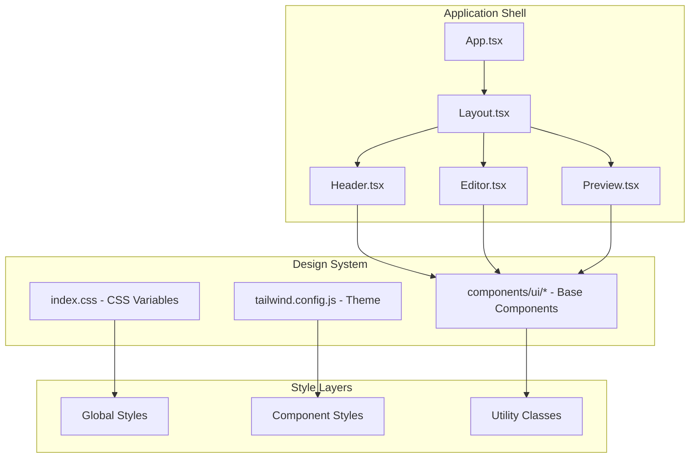

# Design Document: UI Redesign

## Overview

本设计文档详细描述 ResumeForge 简历生成器的 UI 重新设计方案。采用 Swiss Modernism 2.0 和 Soft UI Evolution 设计风格，结合 SaaS 产品级配色方案，提升整体视觉体验和用户交互流畅度。

设计原则：
- **清晰层次** - 通过颜色、间距和阴影建立视觉层次
- **一致性** - 统一的组件样式和交互模式
- **可访问性** - WCAG AA 标准，支持键盘导航和减少动效偏好
- **响应式** - 适配从移动端到桌面端的各种屏幕尺寸

## Architecture



## Components and Interfaces

### 1. Design Token System

```typescript
// src/lib/design-tokens.ts
export const colors = {
  primary: {
    DEFAULT: '#2563EB',
    hover: '#1D4ED8',
    light: '#3B82F6',
    50: '#EFF6FF',
    100: '#DBEAFE',
  },
  secondary: {
    DEFAULT: '#3B82F6',
    hover: '#2563EB',
  },
  cta: {
    DEFAULT: '#F97316',
    hover: '#EA580C',
  },
  background: {
    DEFAULT: '#F8FAFC',
    card: '#FFFFFF',
    muted: '#F1F5F9',
  },
  text: {
    DEFAULT: '#1E293B',
    muted: '#475569',
    light: '#64748B',
  },
  border: {
    DEFAULT: '#E2E8F0',
    focus: '#2563EB',
  },
} as const;

export const spacing = {
  xs: '0.25rem',   // 4px
  sm: '0.5rem',    // 8px
  md: '1rem',      // 16px
  lg: '1.5rem',    // 24px
  xl: '2rem',      // 32px
  '2xl': '3rem',   // 48px
} as const;

export const transitions = {
  fast: '150ms ease-out',
  normal: '200ms ease-out',
  slow: '300ms ease-out',
} as const;
```

### 2. Header Component Redesign

```typescript
// Header 组件接口
interface HeaderProps {
  zoom: number;
  setZoom: (z: number) => void;
}

// Header 样式规范
const headerStyles = {
  container: cn(
    // 浮动定位
    "fixed top-4 left-4 right-4 z-50",
    // 毛玻璃效果
    "bg-white/80 backdrop-blur-xl",
    // 边框和圆角
    "border border-gray-200/50 rounded-2xl",
    // 阴影
    "shadow-lg shadow-gray-200/50",
    // 内边距
    "px-6 py-3",
    // 布局
    "flex items-center justify-between"
  ),
  logoSection: "flex items-center gap-4",
  actionsSection: "flex items-center gap-2",
  divider: "h-6 w-px bg-gray-200 mx-2",
};
```

### 3. Editor Panel Redesign

```typescript
// SectionWrapper 样式规范
const sectionWrapperStyles = {
  container: cn(
    "bg-white rounded-xl",
    "border border-gray-100",
    "transition-all duration-200",
    "hover:shadow-md hover:border-gray-200"
  ),
  header: cn(
    "flex items-center justify-between",
    "px-4 py-3",
    "border-b border-gray-100",
    "cursor-pointer"
  ),
  content: "p-4 space-y-4",
  dragHandle: cn(
    "p-1 rounded hover:bg-gray-100",
    "cursor-grab active:cursor-grabbing",
    "transition-colors duration-150"
  ),
};

// 拖拽状态样式
const dragStyles = {
  dragging: cn(
    "shadow-xl",
    "ring-2 ring-blue-500/20",
    "scale-[1.02]",
    "rotate-1"
  ),
  dropTarget: "ring-2 ring-blue-500 ring-dashed",
};
```

### 4. Preview Area Redesign

```typescript
// Preview 样式规范
const previewStyles = {
  container: cn(
    "flex-1 overflow-hidden",
    "bg-gradient-to-br from-slate-50 via-slate-100 to-slate-50"
  ),
  toolbar: cn(
    "inline-flex items-center gap-2",
    "bg-white/90 backdrop-blur-sm",
    "border border-gray-200/50 rounded-full",
    "px-4 py-2",
    "shadow-sm"
  ),
  paper: cn(
    "bg-white",
    "shadow-2xl shadow-gray-300/50",
    "ring-1 ring-gray-200/50"
  ),
  editModeIndicator: "ring-2 ring-blue-400/50",
};
```

### 5. Button Component Variants

```typescript
// Button 变体定义
const buttonVariants = cva(
  // 基础样式
  cn(
    "inline-flex items-center justify-center gap-2",
    "font-medium text-sm",
    "rounded-lg",
    "transition-all duration-200",
    "focus-visible:outline-none focus-visible:ring-2 focus-visible:ring-offset-2",
    "disabled:opacity-50 disabled:pointer-events-none"
  ),
  {
    variants: {
      variant: {
        primary: cn(
          "bg-blue-600 text-white",
          "hover:bg-blue-700",
          "focus-visible:ring-blue-500"
        ),
        secondary: cn(
          "bg-white text-gray-700",
          "border border-gray-200",
          "hover:bg-gray-50 hover:border-gray-300",
          "focus-visible:ring-gray-400"
        ),
        ghost: cn(
          "text-gray-600",
          "hover:bg-gray-100 hover:text-gray-900",
          "focus-visible:ring-gray-400"
        ),
        danger: cn(
          "bg-red-600 text-white",
          "hover:bg-red-700",
          "focus-visible:ring-red-500"
        ),
      },
      size: {
        sm: "h-8 px-3 text-xs",
        md: "h-10 px-4 text-sm",
        lg: "h-12 px-6 text-base",
        icon: "h-10 w-10",
      },
    },
    defaultVariants: {
      variant: "primary",
      size: "md",
    },
  }
);
```

### 6. Input Component Styles

```typescript
// Input 样式规范
const inputStyles = {
  base: cn(
    "w-full h-10",
    "px-3 py-2",
    "bg-white",
    "border border-gray-200 rounded-lg",
    "text-sm text-gray-900",
    "placeholder:text-gray-400",
    "transition-all duration-200",
    "focus:outline-none focus:ring-2 focus:ring-blue-500/20 focus:border-blue-500"
  ),
  error: "border-red-500 focus:ring-red-500/20 focus:border-red-500",
  disabled: "bg-gray-50 text-gray-500 cursor-not-allowed",
};

// Select 样式规范
const selectStyles = {
  trigger: cn(
    inputStyles.base,
    "flex items-center justify-between",
    "cursor-pointer"
  ),
  content: cn(
    "bg-white",
    "border border-gray-200 rounded-lg",
    "shadow-lg",
    "py-1"
  ),
  item: cn(
    "px-3 py-2",
    "text-sm text-gray-700",
    "cursor-pointer",
    "hover:bg-gray-50",
    "focus:bg-gray-50 focus:outline-none"
  ),
};
```

## Data Models

### CSS Variables Structure

```css
/* src/index.css - 更新后的 CSS 变量 */
:root {
  /* 主色调 */
  --color-primary: 37 99 235;        /* #2563EB */
  --color-primary-hover: 29 78 216;  /* #1D4ED8 */
  --color-primary-light: 59 130 246; /* #3B82F6 */
  
  /* CTA 色 */
  --color-cta: 249 115 22;           /* #F97316 */
  --color-cta-hover: 234 88 12;      /* #EA580C */
  
  /* 背景色 */
  --color-bg: 248 250 252;           /* #F8FAFC */
  --color-bg-card: 255 255 255;      /* #FFFFFF */
  --color-bg-muted: 241 245 249;     /* #F1F5F9 */
  
  /* 文字色 */
  --color-text: 30 41 59;            /* #1E293B */
  --color-text-muted: 71 85 105;     /* #475569 */
  --color-text-light: 100 116 139;   /* #64748B */
  
  /* 边框色 */
  --color-border: 226 232 240;       /* #E2E8F0 */
  --color-border-focus: 37 99 235;   /* #2563EB */
  
  /* 间距 */
  --spacing-xs: 0.25rem;
  --spacing-sm: 0.5rem;
  --spacing-md: 1rem;
  --spacing-lg: 1.5rem;
  --spacing-xl: 2rem;
  
  /* 圆角 */
  --radius-sm: 0.375rem;
  --radius-md: 0.5rem;
  --radius-lg: 0.75rem;
  --radius-xl: 1rem;
  --radius-2xl: 1.5rem;
  
  /* 阴影 */
  --shadow-sm: 0 1px 2px 0 rgb(0 0 0 / 0.05);
  --shadow-md: 0 4px 6px -1px rgb(0 0 0 / 0.1);
  --shadow-lg: 0 10px 15px -3px rgb(0 0 0 / 0.1);
  --shadow-xl: 0 20px 25px -5px rgb(0 0 0 / 0.1);
  
  /* 过渡 */
  --transition-fast: 150ms ease-out;
  --transition-normal: 200ms ease-out;
  --transition-slow: 300ms ease-out;
}
```

### Tailwind Config Extension

```javascript
// tailwind.config.js 扩展
module.exports = {
  theme: {
    extend: {
      colors: {
        primary: {
          DEFAULT: '#2563EB',
          hover: '#1D4ED8',
          light: '#3B82F6',
          50: '#EFF6FF',
          100: '#DBEAFE',
        },
        cta: {
          DEFAULT: '#F97316',
          hover: '#EA580C',
        },
      },
      fontFamily: {
        heading: ['Poppins', 'sans-serif'],
        body: ['Open Sans', 'sans-serif'],
      },
      boxShadow: {
        'glass': '0 8px 32px 0 rgba(31, 38, 135, 0.07)',
        'paper': '0 25px 50px -12px rgba(0, 0, 0, 0.15)',
      },
      backdropBlur: {
        'glass': '20px',
      },
    },
  },
};
```


## Correctness Properties

*A property is a characteristic or behavior that should hold true across all valid executions of a system—essentially, a formal statement about what the system should do. Properties serve as the bridge between human-readable specifications and machine-verifiable correctness guarantees.*

Based on the prework analysis, the following correctness properties have been identified for the UI redesign:

### Property 1: Icon Sizing Consistency

*For any* icon element within the Header component, the icon SHALL have consistent sizing classes (w-4 h-4) applied.

**Validates: Requirements 1.5**

### Property 2: Section Spacing Consistency

*For any* section container in the Editor, the spacing between sections SHALL be gap-4, and *for any* form field group, the spacing SHALL be gap-2.

**Validates: Requirements 2.4**

### Property 3: Edit Mode Visual Indicator

*For any* Preview component state where editMode is true, the preview container SHALL have a blue border indicator class applied.

**Validates: Requirements 3.3**

### Property 4: Color Contrast Compliance

*For any* text element in the application, the color contrast ratio between text and background SHALL meet WCAG AA standard (4.5:1 minimum), and *for any* muted text element, the color SHALL be at least #475569 (slate-600).

**Validates: Requirements 4.2, 4.3**

### Property 5: Interactive Element Cursor

*For any* clickable element (buttons, links, interactive cards), the element SHALL have cursor-pointer class applied.

**Validates: Requirements 5.1**

### Property 6: Transition Timing Consistency

*For any* interactive element with state changes (hover, focus, active), the transition duration SHALL be 200ms with ease-out timing function.

**Validates: Requirements 5.2**

### Property 7: Focus Ring Visibility

*For any* focusable element (buttons, inputs, selects), when focused, the element SHALL display a visible focus ring for keyboard navigation accessibility.

**Validates: Requirements 5.3**

### Property 8: No Horizontal Scroll

*For any* viewport width from 320px to 1920px, the layout SHALL not produce horizontal scrollbar overflow.

**Validates: Requirements 6.3**

### Property 9: Input Styling Consistency

*For any* input field in the application, the element SHALL have consistent height (h-10), rounded corners (rounded-md or rounded-lg), and when focused, SHALL display ring-2 ring-blue-500 ring-offset-2.

**Validates: Requirements 7.3, 7.4**

### Property 10: Select Styling Consistency

*For any* select dropdown in the application, the styling SHALL match input field styling (height, border, rounded corners) with a consistent arrow indicator.

**Validates: Requirements 7.5**

## Error Handling

### CSS Loading Failures

- If Google Fonts fail to load, the application SHALL fall back to system fonts (sans-serif)
- CSS variables SHALL have fallback values defined

### Responsive Breakpoint Edge Cases

- At exactly 768px, the layout SHALL use tablet breakpoint styles
- At exactly 1024px, the layout SHALL use desktop breakpoint styles

### Animation Failures

- If `prefers-reduced-motion: reduce` is set, all animations SHALL be disabled or reduced to instant transitions
- Transition failures SHALL not block user interactions

### Theme Color Validation

- Invalid theme color values SHALL fall back to default primary color (#2563EB)
- Color picker SHALL validate hex format before applying

## Testing Strategy

### Dual Testing Approach

This design requires both unit tests and property-based tests for comprehensive coverage:

**Unit Tests** - Verify specific examples and edge cases:
- Component renders correctly with default props
- Responsive breakpoint behavior at specific widths
- Dark mode class application
- Focus state styling

**Property-Based Tests** - Verify universal properties across all inputs:
- All icons have consistent sizing
- All interactive elements have cursor-pointer
- All inputs have consistent styling
- No horizontal scroll at any viewport width

### Property-Based Testing Configuration

- **Library**: Vitest with fast-check for property-based testing
- **Minimum iterations**: 100 per property test
- **Tag format**: `Feature: ui-redesign, Property {number}: {property_text}`

### Test File Structure

```
src/
├── components/ui/
│   ├── button.test.tsx          # Button variant tests
│   └── input.test.tsx           # Input styling tests
├── features/
│   ├── header/
│   │   └── Header.test.tsx      # Header component tests
│   ├── editor/
│   │   └── Editor.test.tsx      # Editor layout tests
│   └── preview/
│       └── Preview.test.tsx     # Preview styling tests
└── test/
    └── design-system.test.ts    # Property-based design system tests
```

### Key Test Scenarios

1. **Header Tests**
   - Floating position classes applied
   - Glassmorphism classes applied
   - Icon sizing consistency (Property 1)
   - Mobile dropdown behavior

2. **Editor Tests**
   - Section spacing consistency (Property 2)
   - Drag state styling
   - Form field spacing

3. **Preview Tests**
   - Edit mode indicator (Property 3)
   - Gradient background applied
   - Paper shadow effect

4. **Design System Tests**
   - Color contrast compliance (Property 4)
   - Interactive cursor (Property 5)
   - Transition consistency (Property 6)
   - Focus ring visibility (Property 7)
   - No horizontal scroll (Property 8)
   - Input consistency (Property 9)
   - Select consistency (Property 10)
